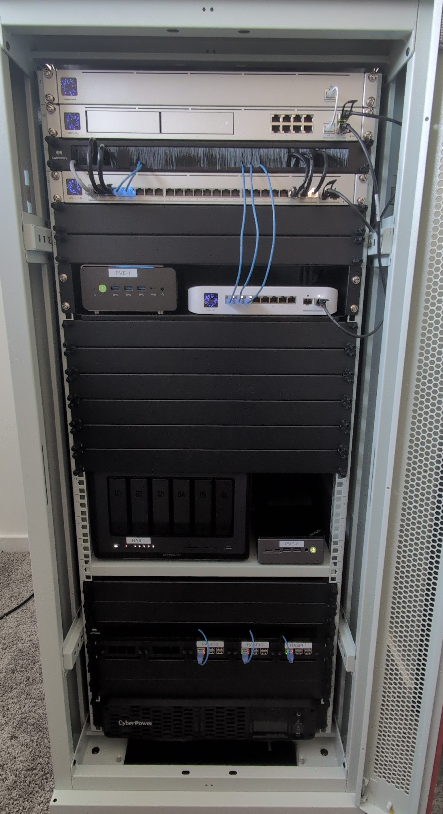

[LICENSE](LICENSE) | [SECURITY](SECURITY.md) | [DISCLAIMER](DISCLAIMER.md)

> *Work in Progress*
>
> This homelab and its documentation are actively evolving. Configurations, architecture, and practices may change as systems are expanded, refined, or reworked.

# Homelab

Welcome to my personal homelab.

This repository documents the design, hardware, software, & operational practices behind my self-hosted infrastructure.

> **What is a homelab?**
>
> A homelab is a personal, self-hosted computing environment used to design, build, and operate real infrastructure at home. It mirrors many of the same concepts found in enterprise and cloud environments—network segmentation, virtualization, storage, security, and automation—but on a smaller, hands-on scale.

The goals of this lab are:

- Hands-on experience with enterprise-style infrastructure
- Strong network segmentation & security practices
- Automation, documentation, & reproducibility
- Running real services with real constraints

## High-Level Overview

- **Primary Use Cases**
  - Virtualization & container orchestration
  - Self-hosted services (media, automation, dev tools)
  - Networking, security, and PKI experimentation
  - Infrastructure-as-Code and automation practice

- **Design Philosophy**
  - Security-first, least privilege networking
  - Separation of concerns via VLANs and zones
  - Preference for open-source and self-hosted solutions
  - Document everything

## Hardware

This homelab is built using a mix of enterprise-grade & consumer hardware, optimized for efficiency, noise, and flexibility.

**Highlights:**

- Rack-mounted infrastructure
- Dedicated storage server
- Multiple compute nodes
- ARM and x64 mixed workloads

Full hardware inventory: [`docs/hardware.md`](docs/hardware.md)

## Networking

The network is segmented into multiple security zones using VLANs and firewall rules.

**Key concepts:**

- Dedicated management network
- Isolated IoT and untrusted devices
- DMZ for public-facing services
- Internal-only production and development zones

**Technologies used:**

- Managed switching with VLANs
- Stateful firewalling
- Internal DNS
- mDNS and service discovery controls

Network architecture details: [`docs/network.md`](docs/network.md)

## Storage

Storage is centralized and designed for reliability and flexibility.

**Features:**

- Network-attached storage
- ZFS-based datasets
- NFS for Linux workloads
- Snapshot-based backups

Storage layout & datasets: [`docs/storage.md`](docs/storage.md)

## Virtualization & Containers

Workloads are split between VMs, containers, and Kubernetes depending on use case.

**Stack includes:**

- Virtual machines for infrastructure services
- Docker / Compose for single-host apps
- Kubernetes (k3s) for clustered services

Virtualization strategy: [`docs/virtualization.md`](docs/virtualization.md)  
Kubernetes details: [`docs/kubernetes.md`](docs/kubernetes.md)

## Security & PKI

Security is treated as a first-class concern.

**Practices include:**

- Internal Certificate Authority (offline root)
- TLS everywhere (even internally)
- Minimal port exposure
- Network-level isolation between services

Security model & PKI: [`docs/security.md`](docs/security.md)

## Backups & Recovery

All critical systems follow a **3-2-1 backup strategy** as best as possible.

- On-site snapshots
- Scheduled VM backups
- Configuration backups stored separately
- Tested restore procedures

Backup strategy: [`docs/backups.md`](docs/backups.md)

## Automation & Tooling

Automation is used wherever possible to reduce manual configuration.

**Examples:**

- Provisioning scripts
- Scheduled maintenance tasks
- Backup verification
- Config templating

Scripts and tooling live in: [`scripts/`](scripts/)

## Future Improvements

Planned or in-progress enhancements:

- Expanded monitoring and alerting
- Improved documentation coverage
- More Infrastructure-as-Code
- Additional high-availability services

## License

This repository is for educational and personal use.  
Feel free to explore, adapt ideas, and learn from it.
